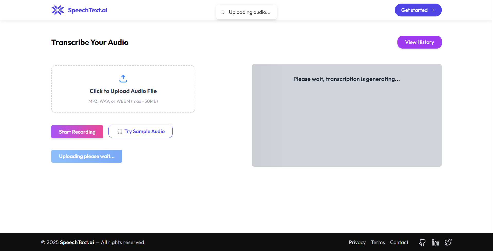

# 🗣️ Speech to Text AI — Frontend

Live App: [https://speech-to-text-ai-frontend.vercel.app](https://speech-to-text-ai-frontend.vercel.app)

An intuitive web app to record or upload audio, convert it to text using AI, and view/edit your transcription history. Built with modern frontend tech and deployed on Vercel.

---

## 📸 Screenshots

<!-- Replace with actual file paths or URLs -->





---

## Features

- Record or upload audio
- Get accurate transcription via AssemblyAI
- Edit transcription on the fly
- View transcription history (for logged-in users)
- Guest access with temporary storage
- Cloudinary-powered file handling
- Clerk-based user auth

---

## Tech Stack

- **React (Vite)**
- **Tailwind CSS**
- **Framer Motion**
- **Clerk** for authentication
- **Cloudinary** for file storage
- **Axios** for API communication

---

## Folder Structure

```plain text

├── public/                      # Publicly accessible assets
│   └── assets/                  # Static files used at runtime (images, audio)
│       ├── gradientBackground.png
│       ├── sample1.wav
│       └── sample.mp3
│
├── src/                         # Source code
│   ├── assets/                  # Internal image assets (icons, logos, etc.)
│   ├── components/              # Reusable UI components
│   │   ├── CompanyMarquee.jsx
│   │   ├── Footer.jsx
│   │   ├── Hero.jsx
│   │   ├── Layout.jsx
│   │   ├── Navbar.jsx
│   │   └── transcribe/          # Transcription-related UI components
│   │       ├── DeleteTranscription.jsx
│   │       ├── EditTranscription.jsx
│   │       ├── RecordAudio.jsx
│   │       ├── TranscriptionViewer.jsx
│   │       └── UploadAudio.jsx
│   │
│   ├── pages/                   # Page-level components (routed via React Router)
│   │   ├── Dashboard.jsx
│   │   ├── History.jsx
│   │   ├── Home.jsx
│   │   └── Transcribe.jsx
│   │
│   ├── App.jsx                  # App root
│   ├── main.jsx                 # Entry point
│   └── index.css                # Global styles
│
├── .env                         # Environment variables
├── .gitignore                   # Git ignore rules
├── index.html                   # Root HTML file
├── package.json                 # NPM dependencies and scripts
├── postcss.config.js            # PostCSS config
├── projectThinking.md           # Planning, notes, or brainstorming doc
├── README.md                    # Project documentation
├── tailwind.config.js           # Tailwind CSS config
├── vite.config.js               # Vite build config
````

---

## ⚙️ Project Setup

- clone the repository

    ```bash
    git clone https://github.com/ankitNegiDev/Speech-To-Text-Ai-Frontend
    ```

- Install dependencies

    ```bash
    npm install
    ```


- Start the development server**  

    ```bash
    npm run dev
    ```

**View in browser**  
Visit `http://localhost:5173` or the port your dev server shows.

---

## Coming Soon with more functionality

- **Translate Transcriptions into Multiple Languages**  
  - I'm working on adding support for translating transcriptions into multiple languages using the DeepL API or any free api.  
  - To improve performance and reduce API usage, I've also implemented backend caching by storing translations in the database—so if the same text is requested again, it won't trigger a new API call. the backend is ready with the route `audioRouter.post('/:id/translate',generalLimiter,translateTranscriptionController)`

- **Export to PDF / DOCX**  
  - I plan to add functionality to export edited transcriptions as PDF or Word documents for easy sharing.

- **Searchable History & Filtering**  
  - I'm planning to enhance the history page with search and filter options so users can easily locate specific transcriptions. and also get the specific transcription edited history based on title of the transcriptions or tags.

---

## 📄 License

MIT License — free for personal or commercial use.

---
